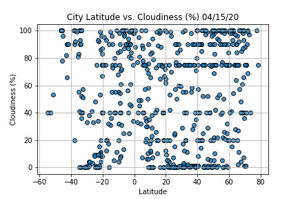
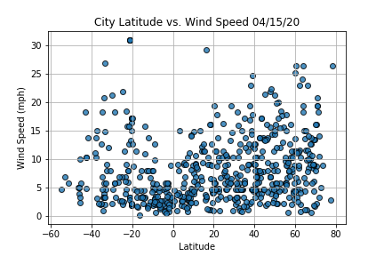

# World_Weather_Analysis

## Project Overview 
Given the task to collect and present data of customer searches for PlanMyTrip, a top-level travel technology company that specializes in internet-related services in the hotel and lodging industry. Customer searches are filtered by preferred travel criteria in order to find their ideal hotel anywhere in the world. After retrieving 500 cities from random latitudes and longitudes, requests are to be performed on OpenWeather API to retrieve the weather data from the cities. A series of scatter plots are to be made to display the relationship between latitude and the variety of weather parameters across the cities around the world. The data will be used to help predict the best time of year for customers to plan their vacation and their ideal vacation spots. 

## Resources 
- Data Source(s): OpenWeatherMap API, Google Maps and Places API, Google Search Nearby feature
- Software: Conda 4.8.3, Python 3.7.7, Request Library 2.23.0, Matplotlib 3.1.3, Citypy 0.0.5 

## Summary - Scatter Plot Deliverables 
 - City Latitude vs. Max Temperature 04/15/20
  

 - City Latitude vs. Humidity 04/15/20
  
 
 - City Latitude vs. Cloudiness (%) 04/15/20
  
 
 - City Latitude vs. Wind Speed 04/15/20 
  

## Challenge Overview 
Requested to add more data to the database so that customers know the weather in the cities when they click on a pop-up marker within a map. Also requested to add the amount of rainfall or snowfall within the last three hours so that customers can filter using input statements based on the temperature range and whether or not it is raining or snowing. In addition, requested to create a directions layer Google map that shows the directions between multiple cities for travel. 

## Challenge Summary 

### Data Source(s): 
 - WeatherPy_challenge.csv, WeatherPy_vacation.csv

### Deliverables 
 - Sample DataFrame of City Data with included Weather Description and Amount of Rain/Snow for Each City

 - Question answered using Pandas Methods: How many cities have recorded rainfall or snow?
  
 
 - Input to Narrow Down Travel Searches Based on Temperature and Precipitation
  
 
 - Sample Hotel DataFrame filtered by Temperature and Rain/Snow Preferences 

 - Vacation Map with filtered Hotel Locations

 
 - Vacation Map Marker Sample

 
 - Selected Cities for Travel Itinerary
 

 
 - Travel Itinerary Map for Selected Cities

 
 - Travel Map Markers for Selected Cities

